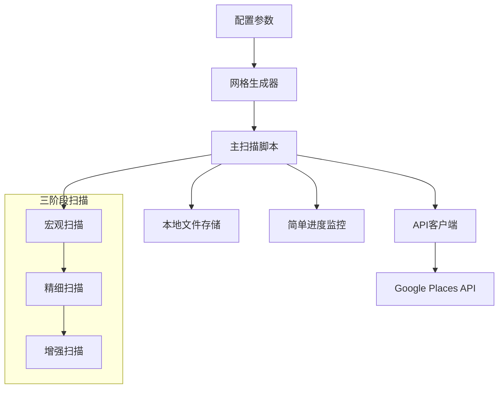

# 设计文档

## 概述

基于高密度网格的便利店数据采集脚本，采用自适应网格扫描策略，通过多阶段数据采集方法，在确保数据完整性的前提下最大化降低Google Places API调用成本。这是一个偶尔运行的数据采集脚本，设计原则是简单可靠，重点关注数据获取而非系统复杂性。

## 架构

### 简化架构图



### 核心组件

1. **配置参数**: 脚本顶部的可配置参数，控制所有扫描行为
2. **网格生成器**: 根据参数生成各级别的搜索网格坐标
3. **主扫描脚本**: 协调三阶段扫描流程的主要逻辑
4. **API客户端**: 处理Google Places API调用和简单重试
5. **本地文件存储**: CSV/JSON文件存储结果和进度
6. **简单进度监控**: 控制台输出进度和成本信息

## 核心配置参数

### 可配置参数列表

```python
# 脚本配置参数 - 所有关键参数都可以通过这里调整
class ScanConfig:
    # 网格参数 - 可根据实际测试结果调整
    MACRO_GRID_SPACING = 7.0      # 宏观扫描网格间距(公里)
    MACRO_SEARCH_RADIUS = 5000    # 宏观扫描半径(米)
    
    FINE_GRID_SPACING = 1.4       # 精细扫描网格间距(公里) 
    FINE_SEARCH_RADIUS = 1000     # 精细扫描半径(米)
    
    # 递归控制参数 - 动态参数计算
    MAX_RECURSION_DEPTH = 3       # 最大递归深度
    RECURSION_TRIGGER_COUNT = 20  # 触发递归的结果数量阈值
    MIN_SEARCH_RADIUS = 200       # 最小搜索半径(米)
    
    # 递归衰减因子 - 每次递归的参数变化比例
    RECURSION_SPACING_FACTOR = 0.5  # 每次递归，网格间距变为原来的50%
    RECURSION_RADIUS_FACTOR = 0.5   # 每次递归，搜索半径变为原来的50%
    
    # 成本控制参数
    MAX_BUDGET = 200.0            # 最大预算(美元)
    API_COST_PER_CALL = 0.032     # 每次API调用成本
    
    # 边界优化参数 - 圆形区域过滤
    ENABLE_BOUNDARY_FILTER = True # 启用圆形边界过滤
    BOUNDARY_BUFFER_KM = 0.5      # 边界缓冲区(公里)，防止边界附近遗漏
    
    # API参数
    API_TIMEOUT = 30              # API超时时间(秒)
    MAX_RETRIES = 3               # 最大重试次数
    RETRY_DELAY = 2               # 重试延迟(秒)
    
    # 地点类型过滤
    PLACE_TYPES = [
        'convenience_store',
        'grocery_store', 
        'food_store',
        'asian_grocery_store',
        'liquor_store'
    ]
    
    # 响应字段
    RESPONSE_FIELDS = [
        'places.id',
        'places.name',
        'places.formattedAddress',
        'places.location',
        'places.postalAddress',
        'places.types',
        'places.photos'
    ]
```

## 组件和接口

### 网格生成器 (GridGenerator)

**职责**: 根据配置参数生成各级别的搜索网格，并进行圆形边界优化

**简化接口**:
```python
class GridGenerator:
    def __init__(self, config: ScanConfig):
        self.config = config
    
    def generate_macro_grid(self, target_area: Area) -> List[GridPoint]:
        """生成宏观网格，包含边界过滤"""
        raw_grid = self._generate_rectangular_grid(target_area, self.config.MACRO_GRID_SPACING)
        return self._filter_grid_by_boundary(raw_grid, target_area) if self.config.ENABLE_BOUNDARY_FILTER else raw_grid
    
    def generate_fine_grid(self, hotspot_areas: List[Area]) -> List[GridPoint]:
        """生成精细网格，包含边界过滤"""
        pass
    
    def generate_enhanced_grid(self, extreme_density_points: List[GridPoint], level: int) -> List[GridPoint]:
        """生成增强网格，包含边界过滤"""
        pass
    
    def should_recurse(self, result_count: int, current_level: int) -> bool:
        """判断是否需要递归扫描"""
        pass
    
    def _filter_grid_by_boundary(self, grid_points: List[GridPoint], target_area: Area) -> List[GridPoint]:
        """使用Haversine距离过滤圆形边界外的网格点"""
        filtered_points = []
        for point in grid_points:
            distance_km = self._haversine_distance(point.center, target_area.center)
            # 添加缓冲区以防边界附近遗漏
            max_distance = target_area.radius_km + self.config.BOUNDARY_BUFFER_KM
            if distance_km <= max_distance:
                filtered_points.append(point)
        return filtered_points
    
    def _haversine_distance(self, coord1: Coordinate, coord2: Coordinate) -> float:
        """计算两点间的Haversine距离(公里)"""
        # 使用标准Haversine公式计算地球表面两点间的大圆距离
        pass
    
    def _generate_rectangular_grid(self, area: Area, spacing_km: float) -> List[GridPoint]:
        """生成覆盖圆形区域的矩形网格"""
        pass
```

**边界优化策略**:
- **矩形网格生成**: 先生成覆盖目标圆形的矩形网格
- **Haversine距离过滤**: 使用精确的地理距离计算过滤边界外网格点
- **缓冲区机制**: 添加0.5公里缓冲区防止边界附近商店遗漏
- **成本节省**: 预计节省15-25%的API调用成本

**参数化网格生成**:
- 所有网格间距和搜索半径都通过配置参数控制
- 递归深度和触发条件可配置
- 边界过滤可通过配置开关控制
- 支持运行时调整参数进行测试和优化

### 主扫描脚本 (MainScanner)

**职责**: 简单的三阶段扫描流程控制和基础错误处理

**简化接口**:
```python
class MainScanner:
    def __init__(self, config: ScanConfig):
        self.config = config
        self.current_cost = 0.0
        self.completed_points = self.load_progress()
    
    def run_scan(self, target_area: Area) -> ScanResult:
        """执行完整的三阶段扫描"""
        # 阶段1: 宏观扫描
        hotspot_areas = self.execute_macro_scan(target_area)
        
        # 阶段2: 精细扫描 
        extreme_density_points = self.execute_fine_scan(hotspot_areas)
        
        # 阶段3: 增强扫描
        self.execute_enhanced_scan(extreme_density_points)
        
        return self.generate_final_report()
    
    def execute_macro_scan(self, target_area: Area) -> List[Area]
    def execute_fine_scan(self, hotspot_areas: List[Area]) -> List[GridPoint]
    def execute_enhanced_scan(self, extreme_density_points: List[GridPoint]) -> None
    def check_budget_limit(self) -> bool
    def save_progress(self, grid_point: GridPoint) -> None
    def load_progress(self) -> Set[str]
```

**简化的扫描流程**:
1. **宏观扫描**: 识别结果=20的高密度热点区域，跳过低密度区域
2. **精细扫描**: 仅在热点区域执行，找出仍然返回20个结果的极端密度点
3. **增强扫描**: 对极端密度点进行更小半径的递归扫描

**扫描会话管理和恢复机制**:
- 每次扫描生成唯一会话ID和状态文件
- 实时保存扫描进度和配置快照
- 支持中断后从断点恢复扫描
- 配置兼容性检查和会话冲突处理

### API客户端 (PlacesAPIClient)

**职责**: 简单的Google Places API调用和基础重试

**简化接口**:
```python
class PlacesAPIClient:
    def __init__(self, config: ScanConfig):
        self.config = config
        self.api_key = os.getenv('GOOGLE_PLACES_API_KEY')
    
    def nearby_search(self, center: Coordinate, radius: int) -> Optional[List[PlaceData]]:
        """执行API调用，包含简单重试逻辑"""
        for attempt in range(self.config.MAX_RETRIES):
            try:
                response = self._make_api_request(center, radius)
                if response and response.status_code == 200:
                    return self._extract_places(response.json())
                elif response.status_code == 429:  # 速率限制
                    time.sleep(self.config.RETRY_DELAY * (2 ** attempt))
                    continue
            except Exception as e:
                print(f"API调用失败 (尝试 {attempt + 1}): {e}")
                if attempt < self.config.MAX_RETRIES - 1:
                    time.sleep(self.config.RETRY_DELAY)
        
        return None  # 所有重试都失败
    
    def _make_api_request(self, center: Coordinate, radius: int) -> requests.Response
    def _extract_places(self, response_data: dict) -> List[PlaceData]
```

**简化的API处理**:
- 基础的重试机制（最多3次）
- 简单的速率限制处理
- 失败时返回None，由调用方决定如何处理

### 本地文件存储 (LocalFileStorage)

**职责**: 简单的本地文件存储和进度跟踪

**简化接口**:
```python
class LocalFileStorage:
    def __init__(self, config: ScanConfig):
        self.config = config
        self.data_dir = "data"
        self.ensure_data_directory()
    
    def save_places(self, places: List[PlaceData], grid_point: GridPoint) -> None:
        """保存扫描结果到CSV文件"""
        filename = f"{self.data_dir}/places_results.csv"
        # 追加模式写入CSV
    
    def save_progress(self, grid_point_id: str) -> None:
        """记录已完成的网格点"""
        progress_file = f"{self.data_dir}/progress.json"
        # 更新进度文件
    
    def load_progress(self) -> Set[str]:
        """加载已完成的网格点列表"""
        progress_file = f"{self.data_dir}/progress.json"
        # 从文件读取已完成的网格点ID
    
    def log_failed_point(self, grid_point: GridPoint, error: str) -> None:
        """记录失败的网格点"""
        with open(f"{self.data_dir}/failed.log", "a") as f:
            f.write(f"{datetime.now()}: {grid_point.id} - {error}\n")
    
    def generate_summary_report(self) -> dict:
        """生成简单的扫描总结报告"""
        return {
            "total_places": self.count_total_places(),
            "total_cost": self.calculate_total_cost(),
            "failed_points": self.count_failed_points()
        }
```

**简化的存储结构**:
- `places_results.csv`: 所有扫描到的商店数据
- `progress.json`: 已完成的网格点ID列表
- `failed.log`: 失败的网格点和错误信息
- `scan_summary.json`: 最终扫描总结报告

### 扫描会话管理器 (ScanSessionManager)

**职责**: 管理扫描会话的创建、保存、加载和恢复

**简化接口**:
```python
class ScanSessionManager:
    def __init__(self, config: ScanConfig):
        self.config = config
        self.sessions_dir = "data/sessions"
        self.ensure_sessions_directory()
    
    def create_new_session(self, target_area: Area) -> ScanSession:
        """创建新的扫描会话"""
        session_id = f"scan_{datetime.now().strftime('%Y%m%d_%H%M%S')}"
        return ScanSession(session_id, target_area, self.config)
    
    def save_session_state(self, session: ScanSession) -> None:
        """保存会话状态到文件"""
        session_file = f"{self.sessions_dir}/{session.session_id}.json"
        # 保存会话状态
    
    def load_session(self, session_id: str) -> Optional[ScanSession]:
        """加载指定的扫描会话"""
        session_file = f"{self.sessions_dir}/{session_id}.json"
        # 从文件加载会话状态
    
    def list_available_sessions(self, target_area: Area = None) -> List[str]:
        """列出可用的扫描会话"""
        # 返回匹配区域的未完成会话列表
    
    def check_config_compatibility(self, session: ScanSession, current_config: ScanConfig) -> bool:
        """检查配置兼容性"""
        # 比较关键配置参数是否兼容
    
    def cleanup_completed_sessions(self) -> None:
        """清理已完成的会话文件"""
        # 删除已完成的临时会话文件
```

**会话管理功能**:
- 自动生成唯一会话ID
- 实时保存扫描状态和进度
- 配置参数兼容性检查
- 会话冲突检测和处理

**会话状态管理**:
- 会话ID生成: `scan_YYYYMMDD_HHMMSS` 格式
- 状态文件: JSON格式存储在 `data/sessions/` 目录
- 配置快照: 保存创建时的完整配置参数
- 进度跟踪: 记录各阶段完成的网格点
- 兼容性检查: 验证关键参数是否发生变化

**关键状态保存时机**:
- **阶段完成时强制保存**: 每个扫描阶段(宏观、精细、增强)完成后立即保存完整会话状态
- **中间状态保存**: 保存 `hotspot_areas` 和 `extreme_density_points` 等关键中间结果
- **网格点完成时保存**: 每完成一个网格点后更新已完成列表
- **异常退出保存**: 捕获异常时自动保存当前状态

```python
# 会话状态保存示例
def save_session_at_key_points(session: ScanSession):
    """在关键节点保存会话状态"""
    
    # 1. 宏观扫描完成后保存
    session.hotspot_areas = discovered_hotspots
    session.current_phase = "fine"
    session_manager.save_session_state(session)
    
    # 2. 精细扫描完成后保存  
    session.extreme_density_points = discovered_extreme_points
    session.current_phase = "enhanced"
    session_manager.save_session_state(session)
    
    # 3. 每个网格点完成后保存
    session.completed_grid_points.add(grid_point.id)
    session.total_api_calls += 1
    session.current_cost = session.total_api_calls * config.API_COST_PER_CALL
    session_manager.save_session_state(session)
```

### 简单进度监控 (SimpleProgressMonitor)

**职责**: 控制台输出进度信息和基础统计

**简化接口**:
```python
class SimpleProgressMonitor:
    def __init__(self, config: ScanConfig):
        self.config = config
        self.start_time = datetime.now()
        self.total_api_calls = 0
        self.current_cost = 0.0
    
    def print_progress(self, completed: int, total: int, current_phase: str) -> None:
        """打印当前进度"""
        percentage = (completed / total) * 100 if total > 0 else 0
        elapsed = datetime.now() - self.start_time
        print(f"[{current_phase}] 进度: {completed}/{total} ({percentage:.1f}%) "
              f"成本: ${self.current_cost:.2f} 用时: {elapsed}")
    
    def update_cost(self, api_calls: int = 1) -> bool:
        """更新成本并检查预算限制"""
        self.total_api_calls += api_calls
        self.current_cost = self.total_api_calls * self.config.API_COST_PER_CALL
        
        if self.current_cost >= self.config.MAX_BUDGET:
            print(f"⚠️  达到预算上限 ${self.config.MAX_BUDGET}，停止扫描")
            return False
        return True
    
    def print_final_summary(self, total_places: int, failed_points: int) -> None:
        """打印最终总结"""
        total_time = datetime.now() - self.start_time
        print(f"\n=== 扫描完成 ===")
        print(f"总共找到商店: {total_places}")
        print(f"API调用次数: {self.total_api_calls}")
        print(f"总成本: ${self.current_cost:.2f}")
        print(f"失败网格点: {failed_points}")
        print(f"总用时: {total_time}")
```

## 数据模型

### 简化数据结构

```python
@dataclass
class Coordinate:
    latitude: float
    longitude: float
    
    def __str__(self):
        return f"{self.latitude},{self.longitude}"

@dataclass  
class GridPoint:
    id: str                    # 唯一标识符
    center: Coordinate         # 网格中心点
    radius: int               # 搜索半径(米)
    level: int                # 扫描级别 (1=宏观, 2=精细, 3=增强)
    
    def __post_init__(self):
        if not self.id:
            self.id = f"grid_{self.level}_{self.center.latitude}_{self.center.longitude}"

@dataclass
class Area:
    center: Coordinate         # 区域中心点
    radius_km: float          # 区域半径(公里)
    name: str                 # 区域名称
    
    @classmethod
    def create_circular(cls, center: Coordinate, radius_km: float, name: str = ""):
        return cls(center=center, radius_km=radius_km, name=name)

@dataclass
class PlaceData:
    place_id: str
    name: str
    formatted_address: str
    latitude: float
    longitude: float
    postal_address: str
    types: List[str]
    photos: List[str]
    
    # 扫描元数据
    grid_point_id: str        # 来源网格点
    scan_time: str           # 扫描时间
    scan_level: int          # 扫描级别
    
    def to_csv_row(self) -> dict:
        """转换为CSV行数据"""
        return {
            'place_id': self.place_id,
            'name': self.name,
            'formatted_address': self.formatted_address,
            'latitude': self.latitude,
            'longitude': self.longitude,
            'postal_address': self.postal_address,
            'types': '|'.join(self.types),
            'photos': '|'.join(self.photos),
            'grid_point_id': self.grid_point_id,
            'scan_time': self.scan_time,
            'scan_level': self.scan_level
        }

@dataclass
class ScanSession:
    session_id: str           # 会话唯一标识符
    target_area: Area         # 目标扫描区域
    config_snapshot: dict     # 配置参数快照
    created_time: str         # 会话创建时间
    last_updated: str         # 最后更新时间
    current_phase: str        # 当前扫描阶段 (macro/fine/enhanced)
    completed_grid_points: Set[str]  # 已完成的网格点ID集合
    hotspot_areas: List[Area] # 发现的热点区域
    extreme_density_points: List[GridPoint]  # 极端密度点
    total_api_calls: int      # 累计API调用次数
    current_cost: float       # 当前累计成本
    is_completed: bool        # 是否已完成
    
    def to_dict(self) -> dict:
        """转换为字典用于JSON序列化"""
        return {
            'session_id': self.session_id,
            'target_area': {
                'center': {'lat': self.target_area.center.latitude, 'lng': self.target_area.center.longitude},
                'radius_km': self.target_area.radius_km,
                'name': self.target_area.name
            },
            'config_snapshot': self.config_snapshot,
            'created_time': self.created_time,
            'last_updated': self.last_updated,
            'current_phase': self.current_phase,
            'completed_grid_points': list(self.completed_grid_points),
            'hotspot_areas': [{'center': {'lat': area.center.latitude, 'lng': area.center.longitude}, 
                              'radius_km': area.radius_km, 'name': area.name} for area in self.hotspot_areas],
            'extreme_density_points': [{'id': point.id, 'center': {'lat': point.center.latitude, 'lng': point.center.longitude}, 
                                      'radius': point.radius, 'level': point.level} for point in self.extreme_density_points],
            'total_api_calls': self.total_api_calls,
            'current_cost': self.current_cost,
            'is_completed': self.is_completed
        }
    
    @classmethod
    def from_dict(cls, data: dict) -> 'ScanSession':
        """从字典创建会话对象"""
        # 实现从JSON数据恢复会话对象的逻辑
        pass

@dataclass
class ScanResult:
    total_places_found: int
    total_api_calls: int
    total_cost: float
    failed_grid_points: int
    scan_duration: str
    session_id: str           # 关联的会话ID
    
    def to_dict(self) -> dict:
        return {
            'total_places_found': self.total_places_found,
            'total_api_calls': self.total_api_calls,
            'total_cost': self.total_cost,
            'failed_grid_points': self.failed_grid_points,
            'scan_duration': self.scan_duration,
            'session_id': self.session_id,
            'cost_per_place': self.total_cost / max(self.total_places_found, 1)
        }
```

## 边界优化策略

### 圆形区域边界过滤

**问题背景**: 
- 目标扫描区域是半径60英里的圆形区域
- 传统矩形网格会在四个角落产生大量无效网格点
- 对圆形外网格点的API调用是纯粹的成本浪费
- 预计可节省15-25%的API调用成本

**解决方案**: 使用Haversine距离公式进行API调用前的边界检查

### 实施策略

**核心逻辑流程**:
```python
def execute_boundary_filtered_scan():
    """边界过滤扫描的核心逻辑"""
    
    # 1. 定义目标圆形区域
    center_point = {"lat": 34.0522, "lng": -118.2437}  # 洛杉矶市中心
    max_radius_km = 96.56  # 60英里 ≈ 96.56公里
    
    # 2. 生成覆盖圆形的矩形网格
    all_grid_points = generate_rectangular_grid(center_point, max_radius_km)
    
    # 3. 主扫描循环 - 包含边界检查
    for grid_point in all_grid_points:
        
        # *** 关键步骤: API调用前的边界检查 ***
        distance_to_center = haversine_distance(center_point, grid_point.center)
        
        # 添加缓冲区防止边界附近遗漏
        effective_radius = max_radius_km + BOUNDARY_BUFFER_KM
        
        if distance_to_center > effective_radius:
            # 跳过圆形区域外的网格点，节省API调用成本
            print(f"跳过网格点 {grid_point.id} - 距离中心 {distance_to_center:.2f}km，超出目标半径")
            continue
        
        # 仅对圆形区域内的有效网格点执行API调用
        execute_adaptive_scan_for_point(grid_point)
```

**Haversine距离计算**:
```python
import math

def haversine_distance(coord1: Coordinate, coord2: Coordinate) -> float:
    """
    使用Haversine公式计算地球表面两点间的大圆距离
    
    Args:
        coord1: 第一个坐标点 (纬度, 经度)
        coord2: 第二个坐标点 (纬度, 经度)
    
    Returns:
        距离(公里)
    """
    # 地球半径 (公里)
    R = 6371.0
    
    # 转换为弧度
    lat1_rad = math.radians(coord1.latitude)
    lon1_rad = math.radians(coord1.longitude)
    lat2_rad = math.radians(coord2.latitude)
    lon2_rad = math.radians(coord2.longitude)
    
    # Haversine公式
    dlat = lat2_rad - lat1_rad
    dlon = lon2_rad - lon1_rad
    
    a = (math.sin(dlat/2)**2 + 
         math.cos(lat1_rad) * math.cos(lat2_rad) * math.sin(dlon/2)**2)
    c = 2 * math.asin(math.sqrt(a))
    
    return R * c
```

### 成本效益分析

**理论节省计算**:
- 圆形面积: π × 60² ≈ 11,310 平方英里
- 覆盖矩形面积: 120 × 120 = 14,400 平方英里
- 浪费区域: 14,400 - 11,310 = 3,090 平方英里
- **节省比例**: 约21.5%的网格点可以跳过

**实际优化效果**:
- **API调用减少**: 15-25% (考虑网格分布不均匀)
- **成本节省**: 每次大规模扫描节省$30-50
- **计算成本**: Haversine计算几乎为零成本
- **精度保证**: 0.5公里缓冲区确保边界附近不遗漏

### 配置参数

```python
# 边界优化相关配置
ENABLE_BOUNDARY_FILTER = True    # 启用边界过滤
BOUNDARY_BUFFER_KM = 0.5         # 边界缓冲区(公里)
EARTH_RADIUS_KM = 6371.0         # 地球半径常数
```

### 边界检查集成点

**在各扫描阶段的应用**:
1. **宏观扫描**: 过滤7公里间距的粗网格
2. **精细扫描**: 过滤1.4公里间距的精细网格  
3. **增强扫描**: 过滤0.7公里间距的增强网格

**性能优化**:
- 边界检查在网格生成后立即执行
- 避免为无效网格点创建数据结构
- 在进度统计中排除已过滤的网格点

## 简化错误处理

### 基础错误处理策略

```python
def simple_error_handling():
    """简单实用的错误处理方法"""
    
    # 1. API调用失败 - 简单重试后跳过
    def handle_api_failure(grid_point, error):
        log_failed_point(grid_point, str(error))
        print(f"⚠️  网格点 {grid_point.id} 失败: {error}")
        # 不阻塞整个流程，继续下一个点
    
    # 2. 预算超限 - 立即停止
    def handle_budget_exceeded():
        print(f"💰 达到预算上限，停止扫描")
        save_current_progress()
        sys.exit(0)
    
    # 3. 网络问题 - 等待后重试
    def handle_network_issue():
        print("🌐 网络问题，等待30秒后继续...")
        time.sleep(30)
    
    # 4. 数据重复 - 基于place_id去重
    def handle_duplicates(places_list):
        seen_ids = set()
        unique_places = []
        for place in places_list:
            if place.place_id not in seen_ids:
                unique_places.append(place)
                seen_ids.add(place.place_id)
        return unique_places
```

### 简单的数据完整性

- **进度跟踪**: 每完成一个网格点就立即记录到progress.json
- **失败记录**: 失败的网格点记录到failed.log，可手动重试
- **重复处理**: 基于place_id进行简单去重
- **预算控制**: 硬性预算上限，超过就停止

## 简化测试策略

### 阶段一：参数验证测试（无API调用成本）

**目标**: 验证网格参数和配置的合理性

1. **网格参数测试**:
   ```python
   # 测试不同的网格参数组合
   test_configs = [
       {"macro_spacing": 7.0, "macro_radius": 5000},
       {"macro_spacing": 5.0, "macro_radius": 3000},  # 更密集的测试
       {"fine_spacing": 1.4, "fine_radius": 1000},
       {"enhanced_spacing": 0.7, "enhanced_radius": 500}
   ]
   ```

2. **递归控制测试**:
   - 验证MAX_RECURSION_DEPTH参数防止无限递归
   - 测试MIN_SEARCH_RADIUS作为递归终止条件
   - 验证RECURSION_TRIGGER_COUNT的触发逻辑

3. **成本估算验证**:
   - 使用模拟数据验证成本计算准确性
   - 测试预算控制机制

### 阶段二：小规模真实API测试

**目标**: 用少量API调用验证核心功能

1. **单点测试** (成本: ~$0.10):
   - 选择1-2个已知的高密度区域进行单网格点测试
   - 验证API响应解析和数据存储

2. **小区域完整流程测试** (成本: ~$5-10):
   - 选择1平方公里的小区域测试完整三阶段流程
   - 验证递归逻辑和数据去重

### 阶段三：参数优化测试

**目标**: 基于小规模测试结果优化参数

1. **网格间距优化**:
   - 比较不同间距的覆盖效果和成本
   - 找到最优的间距/半径比例

2. **递归深度调整**:
   - 根据实际密度分布调整递归参数
   - 平衡数据完整性和成本控制

## 简化监控和日志

### 控制台输出监控

```python
# 简单的进度显示
def print_simple_progress():
    print(f"[宏观扫描] 进度: 45/100 (45%) 成本: $1.44 用时: 0:05:23")
    print(f"发现热点区域: 8个 (需要精细扫描)")
    print(f"跳过低密度区域: 37个")
```

### 基础日志记录

```python
# 简单的日志文件
def log_to_file(message, level="INFO"):
    timestamp = datetime.now().strftime("%Y-%m-%d %H:%M:%S")
    with open("scan.log", "a") as f:
        f.write(f"[{timestamp}] {level}: {message}\n")
```

### 最终报告

```python
# 生成简单的扫描报告
def generate_final_report():
    return {
        "scan_date": datetime.now().isoformat(),
        "total_places": 1247,
        "total_cost": 15.68,
        "api_calls": 490,
        "cost_per_place": 0.0126,
        "failed_grids": 3,
        "scan_duration": "2:34:15"
    }
```

## 项目文件结构

```
corner_store_scanner/
├── main.py                 # 主扫描脚本
├── config.py              # 配置参数
├── grid_generator.py      # 网格生成
├── places_client.py       # API客户端
├── file_storage.py        # 文件存储
├── progress_monitor.py    # 进度监控
├── session_manager.py     # 会话管理器
├── data/                  # 数据目录
│   ├── places_results.csv # 扫描结果
│   ├── progress.json      # 进度记录
│   ├── failed.log         # 失败日志
│   ├── scan_summary.json  # 扫描总结
│   └── sessions/          # 会话状态目录
│       ├── scan_20241217_143022.json  # 会话状态文件
│       └── scan_20241218_091530.json  # 其他会话状态
├── tests/                 # 测试文件
│   ├── test_grid.py       # 网格测试
│   ├── test_config.py     # 配置测试
│   └── test_session.py    # 会话管理测试
└── README.md              # 使用说明
```

## 使用方式

### 基础扫描命令

```bash
# 基础使用 - 新建扫描任务
python main.py --center "34.0522,-118.2437" --radius 50

# 自定义参数扫描
python main.py --center "34.0522,-118.2437" --radius 50 \
  --budget 100 --macro-spacing 5.0 --max-depth 2
```

### 会话管理命令

```bash
# 恢复指定的扫描会话
python main.py --resume --scan-id "scan_20241217_143022"

# 列出可用的扫描会话
python main.py --list-sessions

# 列出指定区域的可用会话
python main.py --list-sessions --center "34.0522,-118.2437" --radius 50

# 清理已完成的会话文件
python main.py --cleanup-sessions
```

### 会话恢复流程

1. **自动检测**: 系统启动时自动检测是否存在未完成的会话
2. **兼容性检查**: 验证当前配置与保存的配置是否兼容
3. **用户确认**: 如果发现配置差异，提示用户确认是否继续
4. **断点恢复**: 从上次中断的网格点继续扫描
5. **状态同步**: 恢复累计成本、API调用次数等状态信息

### 会话状态文件示例

```json
{
  "session_id": "scan_20241217_143022",
  "target_area": {
    "center": {"lat": 34.0522, "lng": -118.2437},
    "radius_km": 50.0,
    "name": "Los Angeles Area"
  },
  "config_snapshot": {
    "MACRO_GRID_SPACING": 7.0,
    "MACRO_SEARCH_RADIUS": 5000,
    "MAX_BUDGET": 200.0,
    "API_COST_PER_CALL": 0.032
  },
  "created_time": "2024-12-17T14:30:22",
  "last_updated": "2024-12-17T16:45:30",
  "current_phase": "fine",
  "completed_grid_points": ["grid_1_34.0522_-118.2437", "grid_1_34.0622_-118.2437"],
  "total_api_calls": 45,
  "current_cost": 1.44,
  "is_completed": false
}
```